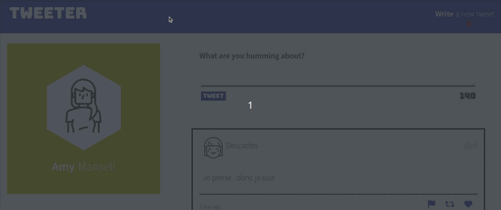

# Tweeter Project

Tweeter is a simple, single-page Twitter clone. Tweeter is a responsive layote app designed to work on desktop computer, laptop, tablet and mobile device.
Existing tweets display in reverse-chronological order. Character counter allows to control the tweet length. Error messages inform and help users to work with app comfortably.
The app uses HTML5, CSS3, JS, jQuery, Express, Node and AJAX.

Tweet!

## Final Product

## Dependencies

- Node.js
- Express
- Body-parser
- Chance
- md5
- timeago.js

## Getting Started

- Install all dependencies (using the `npm install` command).
- Run the development web server (using the npm run local command).